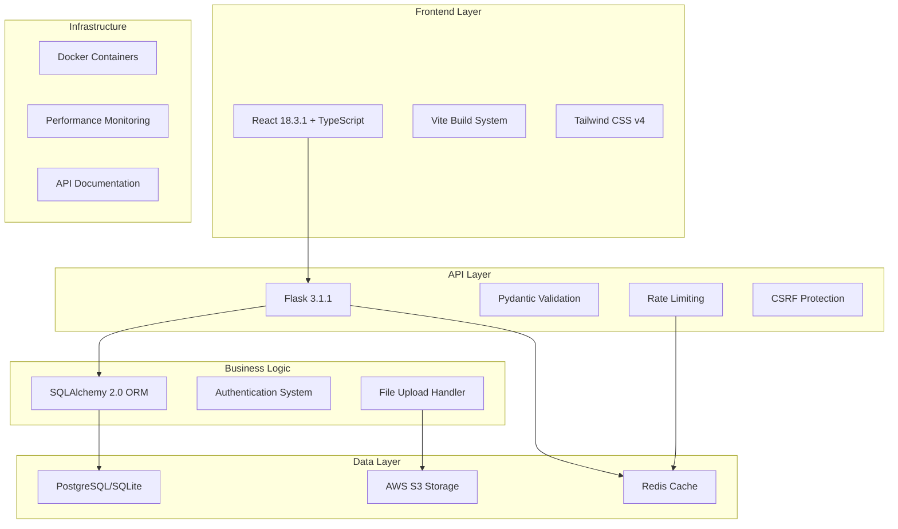
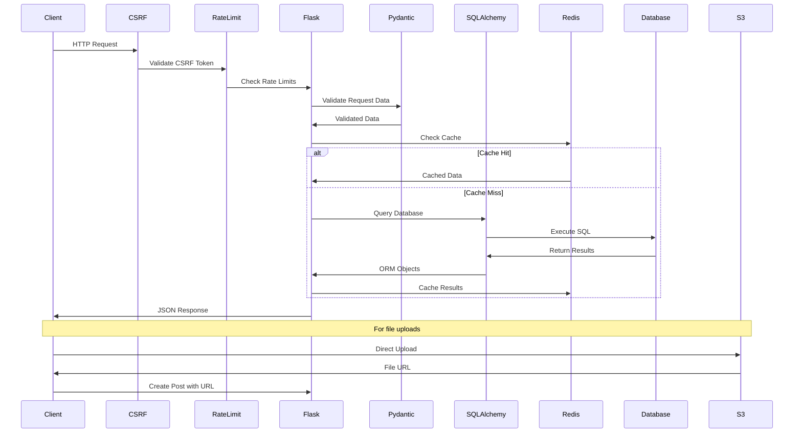
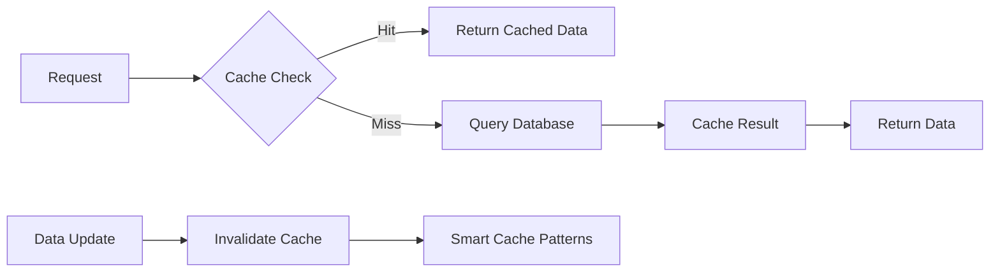
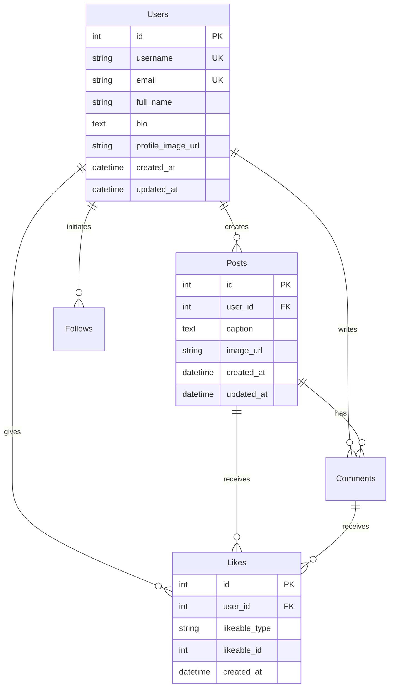

# System Architecture Overview

> Modern full-stack Instagram clone with production-ready features

## High-Level Architecture



## Technology Stack

### Frontend (React 18 + TypeScript)
- **React 18.3.1**: Modern hooks, concurrent features, strict mode
- **TypeScript**: Full type safety with strict configuration  
- **Vite 7.0.6**: Lightning-fast development and build system
- **Tailwind CSS v4**: Utility-first styling with custom design tokens
- **React Router v6**: Modern routing with nested routes

### Backend (Flask 3.1 + SQLAlchemy 2.0)
- **Flask 3.1.1**: Modern Python web framework
- **SQLAlchemy 2.0**: Next-generation ORM with type annotations
- **Pydantic 2.10**: Data validation and serialization
- **Flask-Login**: Session management and authentication
- **Flask-Migrate**: Database migrations with Alembic

### Production Features (Phase 4)
- **Flask-Limiter**: API rate limiting with Redis backend
- **Redis**: Caching, session storage, rate limiting storage
- **Flasgger**: OpenAPI/Swagger documentation generation
- **CSRF Protection**: Flask-WTF security tokens

### Data Storage
- **PostgreSQL**: Production database with advanced features
- **SQLite**: Development database for simplicity
- **AWS S3**: Image and media file storage
- **Redis**: High-performance caching and temporary data

## Request Flow Architecture



## Security Architecture

### Multi-Layer Security Model

1. **Request Level Security**
   - CSRF token validation on all state-changing operations
   - Rate limiting per endpoint and user
   - Input sanitization and validation

2. **Authentication Layer**
   - Flask-Login session management
   - JWT token support for API access
   - Secure session cookies (HttpOnly, Secure, SameSite)

3. **Data Validation**
   - Pydantic schemas for all API inputs
   - SQLAlchemy type checking and constraints
   - File type and size validation for uploads

4. **Infrastructure Security**
   - HTTPS enforcement in production
   - Database connection encryption
   - AWS S3 bucket security policies

## Performance Architecture

### Database Performance
- **Strategic Indexing**: 14 optimized indexes for common queries
- **N+1 Prevention**: `joinedload()` and `selectinload()` patterns
- **Query Optimization**: Sub-10ms average query times
- **Connection Pooling**: Efficient database connection management

### Caching Strategy


**Cache Layers:**
- **Application Cache**: Redis for frequently accessed data
- **Query Result Cache**: Database query result caching
- **Static Asset Cache**: CDN for images and static files
- **Browser Cache**: Client-side caching headers

### Scalability Patterns
- **Horizontal Scaling**: Stateless application design
- **Database Sharding**: User-based data partitioning ready
- **CDN Integration**: Global asset delivery
- **Microservice Ready**: Modular blueprint architecture

## Data Architecture

### Database Design Principles
- **Normalized Schema**: Proper relational design
- **Polymorphic Relationships**: Flexible like/comment system
- **Audit Trails**: Created/updated timestamps on all entities
- **Soft Deletes**: Data preservation for analytics

### Entity Relationships


## API Architecture

### RESTful Design Principles
- **Resource-Based URLs**: `/api/post/123` not `/api/getPost`
- **HTTP Method Semantics**: GET, POST, PUT, DELETE properly used
- **Consistent Response Format**: Standardized JSON structure
- **Proper Status Codes**: Meaningful HTTP status codes

### API Versioning Strategy
- **URL Versioning**: `/api/v1/posts` for major changes
- **Header Versioning**: `Accept: application/vnd.api+json;version=1`
- **Backward Compatibility**: Maintain previous API versions
- **Deprecation Policy**: 6-month deprecation notice

### Documentation Standards
- **OpenAPI 3.0**: Industry-standard API specification
- **Interactive Docs**: Swagger UI for live testing
- **Code Examples**: curl, JavaScript, Python examples
- **Error Documentation**: Complete error code reference

## Deployment Architecture

### Development Environment
```bash
# Local development stack
├── Flask Development Server (port 8080)
├── SQLite Database (file-based)
├── Redis (optional, memory fallback)
└── Local File Storage (development)
```

### Production Environment
```bash
# Production deployment stack
├── Gunicorn WSGI Server
├── Nginx Reverse Proxy
├── PostgreSQL Database Cluster
├── Redis Cluster
├── AWS S3 + CloudFront CDN
└── Docker Containers
```

### Monitoring & Observability
- **Application Metrics**: Response times, error rates
- **Database Monitoring**: Query performance, connection pooling
- **Cache Metrics**: Hit rates, memory usage
- **Business Metrics**: User engagement, post creation rates

## Modernization Journey (2020 → 2025)

### Phase 1: Database Foundation
- ✅ Performance indexes (14 strategic indexes)
- ✅ Query optimization (sub-10ms targets)
- ✅ Connection pooling setup

### Phase 2: Model Modernization  
- ✅ SQLAlchemy 1.4 → 2.0 migration
- ✅ Pydantic integration for validation
- ✅ Type safety with Mapped[] annotations

### Phase 3: API Modernization
- ✅ WTForms → Pydantic validation
- ✅ Modern error handling patterns
- ✅ Type-safe request/response handling

### Phase 4: Production Features
- ✅ Rate limiting with Flask-Limiter
- ✅ Redis caching with smart invalidation
- ✅ OpenAPI/Swagger documentation
- ✅ CSRF protection and security hardening

## Future Enhancements

### Phase 5: Advanced Features (Planned)
- **Real-time Features**: WebSocket integration for live updates
- **Advanced Search**: Elasticsearch for content discovery
- **AI/ML Integration**: Content recommendation engine
- **Microservices**: Service decomposition for scale

### Performance Targets
- **API Response Time**: < 100ms for 95th percentile
- **Database Queries**: < 5ms average
- **Cache Hit Rate**: > 90% for frequently accessed data
- **Concurrent Users**: Support 10,000+ simultaneous users

---

**Related Documentation**: 
- [Database Design](./database.md)
- [Security Model](./security.md) 
- [Performance Optimization](./performance.md)
- [API Reference](../api/authentication.md)